# CK-0 Capability Ban List

**Version:** 1.0  
**Status:** Canonical  
**Phase:** Phase 0 (Pre-Build Tightening)

---

## Overview

This document defines the **capability ban list** for all components that must operate under **GLB (Global Ledger Blindness)**. The ban list prevents ambient nondeterminism by prohibiting access to system capabilities that could introduce non-deterministic behavior in kernel computations, the coherence functional, or footprint functions.

The capability ban is a **structural guarantee**: forbidden capabilities must be unrepresentable in the type system, not merely discouraged by policy.

---

## 1. Banned Capabilities

### 1.1 Complete Ban List

| # | Capability | Ban Scope | Rationale |
|---|------------|-----------|------------|
| 1 | **System Clock** | All | Time-varying results break replay-verification; CTD theorem requires ledger-blind V(x) |
| 2 | **Random / RNG** | All | Non-deterministic outputs violate receipt reproducibility; V(x) must be deterministic |
| 3 | **Thread Count** | All | Scheduling-dependent behavior introduces nondeterminism; execution must be replayable |
| 4 | **Environment Variables** | All | Environment-dependent behavior breaks cross-platform determinism; cf. sorting rules |
| 5 | **Filesystem Enumeration** | All | File presence/absence introduces environment-specific nondeterminism |
| 6 | **Hash Map Iteration Order** | All | Non-deterministic iteration breaks deterministic DAG construction; cf. lex-toposort |
| 7 | **Network Access** | All | Network state is inherently non-deterministic; must be ledger-blind |
| 8 | **Process ID** | All | PID varies across runs/invocations; cannot appear in any computation path |

### 1.2 Rationale Details

#### System Clock (Time)

- **Why banned:** The CTD-BS theorem requires V(x) to be a function of state only. Time-varying V(x) breaks the inequality `D_{k+1} ≤ D_k - S(D_k, B_k) + E_k`.
- **Consequence:** Replay verification becomes impossible if V varies by wall-clock time.
- **Exception:** None. Clock time must not appear in any kernel, V_DU, or footprint computation.

#### Random / RNG

- **Why banned:** V(x) and kernel outputs must be deterministic functions. Any randomness reintroduces the exact nondeterminism CK-0 eliminates.
- **Consequence:** Receipts cannot prove replay correctness if any component uses RNG.
- **Exception:** None. Pseudo-RNG with fixed seed is still banned—it is not a function of state.

#### Thread Count

- **Why banned:** Scheduling decisions must be deterministic and derivable from the ExecPlan alone. Thread count visibility creates scheduling-dependent paths.
- **Consequence:** Same program could produce different DAG schedules on different thread pools.
- **Exception:** None. Thread count must not influence kernel or V computation.

#### Environment Variables

- **Why banned:** Environment variables (e.g., `LC_ALL`, `PYTHONPATH`, `PATH`) cause locale-dependent and platform-dependent behavior. This directly violates the sorting rules in [`D_sorting_rules.md`](D_sorting_rules.md).
- **Consequence:** Sorting, string comparisons, and canonicalization become non-deterministic across environments.
- **Exception:** None. Kernels and V_DU must compile identically on all platforms.

#### Filesystem Enumeration

- **Why banned:** Filesystem state is external to the Noetica state machine. Enumeration (e.g., `listdir`, `glob`, `stat`) introduces environment-dependent paths.
- **Consequence:** Kernel behavior could differ based on filesystem contents.
- **Exception:** None. All file paths must be explicit inputs, not discovered.

#### Hash Map Iteration Order

- **Why banned:** Python dicts, Rust HashMaps, and equivalent structures have non-specified iteration order. This breaks deterministic lex-toposort (cf. [`nk3/5_dag.md`](../nk3/5_dag.md)).
- **Consequence:** DAG node ordering becomes non-deterministic across implementations.
- **Exception:** None. All collections must use sorted containers (e.g., `sortedcontainers.SortedDict`).

#### Network Access

- **Why banned:** Network state (availability, latency, DNS) is inherently non-deterministic and uncontrollable. Kernels must be ledger-blind; network access would violate GLB.
- **Consequence:** Kernel execution could depend on external network state.
- **Exception:** None. Network calls must not appear in lowering or execution.

#### Process ID

- **Why banned:** PID varies per invocation and per process. Inclusion in any computation path creates non-deterministic output.
- **Consequence:** Kernel hashes, V_DU outputs, or receipts could differ across runs.
- **Exception:** None. PID must not appear in any computation.

---

## 2. Where the Ban Applies

### 2.1 Component Scope

| Component | Ban Applies? | Description |
|-----------|--------------|-------------|
| **kernel** | ✅ Yes | All kernel implementations (`f_g : State → State`) |
| **V_DU** | ✅ Yes | Coherence functional in DebtUnit form (`V_DU : State → ℤ_{≥0}`) |
| **footprint_fn** | ✅ Yes | Param-decidable footprint functions (`footprint(params) → (R, W, ...)`) |
| **NK-3 lowering** | ✅ Yes | All lowering transformations from NSC to OpSet/DAG/ExecPlan |

### 2.2 Architectural Position

```
┌─────────────────────────────────────────────────────────────┐
│                    Noetica Stack                             │
├─────────────────────────────────────────────────────────────┤
│  NK-3: Lowering (this ban applies)                         │
│    - NSC → OpSet/DAG/ExecPlan                              │
│    - No time, no RNG, no env, no network                   │
├─────────────────────────────────────────────────────────────┤
│  NK-2: Runtime Exec + Scheduler                             │
│    - ExecPlan-bound scheduling only                        │
├─────────────────────────────────────────────────────────────┤
│  NK-1: Measured Gate Runtime                                │
│    - V_DU : State → DebtUnitInt (this ban applies)        │
├─────────────────────────────────────────────────────────────┤
│  CK-0: Mathematical Foundations                             │
│    - V : X → ℝ≥0 (mathematical functional)                  │
│    - V_DU : X → ℤ≥0 (DebtUnit-scaled, ledger-blind)       │
└─────────────────────────────────────────────────────────────┘
         ↓                    ↓                    ↓
   ┌──────────┐        ┌──────────┐        ┌──────────┐
   │  kernel  │        │   V_DU   │        │footprint_│
   │ f_g:     │        │ V_DU:    │        │   fn     │
   │ State→   │        │ State→   │        │params→   │
   │ State    │        │ DebtUnit │        │(R,W,...) │
   └──────────┘        └──────────┘        └──────────┘
        ↑                    ↑                    ↑
        └──────── BAN ALL OF THESE ──────────────┘
        No clock, RNG, thread count, env, filesystem,
        iteration order, network, or PID access.
```

### 2.3 StateCtx API (The Only Allowed Interface)

Kernels, V_DU, and footprint functions may only access state through the restricted `StateCtx` API:

| Operation | Allowed? | Description |
|-----------|----------|-------------|
| `read(field_id)` | ✅ Yes | Read a state field value |
| `schema_constants()` | ✅ Yes | Read immutable schema constants |
| `write(field_id, value)` | ✅ Yes | Write to a state field (kernels only) |
| `get_ledger()` | ❌ No | Ledger access is forbidden |
| `get_time()` | ❌ No | Clock access is forbidden |
| `get_thread_count()` | ❌ No | Thread info is forbidden |
| `get_env(key)` | ❌ No | Environment access is forbidden |
| `network_request(...)` | ❌ No | Network access is forbidden |
| `get_pid()` | ❌ No | Process ID is forbidden |

---

## 3. Enforcement Mechanism

### 3.1 Priority Order (Canon)

| Priority | Mechanism | Description |
|----------|-----------|-------------|
| **1 (Primary)** | Compile-time typing | Forbidden capabilities are unrepresentable in the type system |
| **2 (Backstop)** | Runtime traps | Deterministic failure if any banned capability is invoked |
| **3 (Audit)** | Verifier artifacts | Receipts must prove enforcement mode; verifier rejects unproven code |

### 3.2 Compile-Time Typing (Primary)

**The core guarantee:** Kernels and V_DU must compile in a capability-erased fragment where only `StateCtx` is available.

**Implementation approaches:**

1. **Capability-typed IR:** Use a restricted intermediate representation where forbidden imports are syntactically impossible.
2. **WASM sandbox:** Compile to WebAssembly with no host imports except `read_field` and `write_field`.
3. **Language subset:** Use a language profile that prohibits standard library imports for time, random, os, sys, etc.

**Why this is primary:** It provides a *proof by construction*. The forbidden thing cannot be expressed, so "oops I used it" cannot occur.

### 3.3 Runtime Traps (Backstop)

Runtime traps catch:

- JIT/linker errors
- Host misconfiguration
- Accidental inclusion of forbidden syscalls
- Malicious kernels attempting to escape

**Required trap behaviors:**

| Banned Capability | Trap Behavior |
|-------------------|---------------|
| System Clock | Any `time.*` call → deterministic panic with `E_CAPABILITY_BANNED` |
| RNG | Any `random.*`, `math.random`, `rand()` call → panic |
| Thread Count | Any thread-ID query → panic |
| Environment Variables | Any `getenv`, `os.environ` access → panic |
| Filesystem | Any `readdir`, `stat`, `open` for enumeration → panic |
| Hash Map Iteration | Unordered dict use in critical paths → lint failure |
| Network | Any socket/DNS call → panic |
| Process ID | Any `getpid`, `ProcessHandle` access → panic |

**Deterministic requirement:** Traps must produce identical error codes/messages across all platforms. No stack traces that include non-deterministic addresses.

### 3.4 Verifier Artifacts (Audit)

The verifier must require receipt-bound fields proving enforcement:

| Receipt Field | Description |
|---------------|-------------|
| `kernel_hash` | Hash of kernel implementation |
| `v_function_hash` | Hash of V_DU implementation |
| `footprint_fn_hash` | Hash of footprint function (if param-decidable) |
| `glb_mode_id` | Enforcement mode identifier (e.g., `id:static_plus_trap.v1`) |
| `kernel_sandbox_id` | Compiler pipeline / sandbox identifier |

**Verifier rule:**

> Accept only if `kernel_hash` and `v_function_hash` are allowlisted under the specific `glb_mode_id` in the PolicyBundle.

---

## 4. Verification Requirements

### 4.1 Required Verification Artifacts

| Artifact | Source | Purpose |
|----------|--------|---------|
| Kernel hash allowlist | PolicyBundle | Proves kernel is in approved set |
| V_DU hash allowlist | PolicyBundle | Proves V function is ledger-blind |
| Footprint_fn allowlist | PolicyBundle | Proves footprint function is approved |
| Enforcement mode proof | Compiler output | Proves static typing was applied |
| Runtime trap coverage | Test suite | Proves all banned capabilities trap |

### 4.2 Verification Checklist

For each kernel, V_DU, and footprint function:

- [ ] **Static analysis:** Prove no banned imports are used
- [ ] **Compilation:** Confirm code compiles in restricted fragment
- [ ] **Runtime test:** Confirm all 8 banned capabilities trigger deterministic traps
- [ ] **Hash binding:** Confirm hash is in PolicyBundle allowlist
- [ ] **GLB mode:** Confirm `glb_enforcement_strength = id:static_plus_trap.v1` is set

### 4.3 PolicyBundle Binding

Add to PolicyBundle schema:

```yaml
glb_enforcement_strength: id:static_plus_trap.v1  # Required for CK-0 compliance
```

Implementations cannot quietly downgrade to "trap-only" or "trust me" mode.

---

## 5. Mermaid: Capability Flow

```mermaid
flowchart TD
    subgraph "Banned Capabilities"
        T[System Clock]
        R[Random / RNG]
        Th[Thread Count]
        E[Environment Variables]
        F[Filesystem Enumeration]
        H[Hash Map Iteration]
        N[Network Access]
        P[Process ID]
    end

    subgraph "StateCtx API (Allowed)"
        READ[read field_id]
        SCHEMA[schema_constants]
        WRITE[write field_id]
    end

    subgraph "Subject to Ban"
        K[kernel f_g]
        V[V_DU coherence functional]
        FNP[footprint_fn]
        NK3[NK-3 Lowering]
    end

    T -.->|FORBIDDEN| K
    R -.->|FORBIDDEN| K
    Th -.->|FORBIDDEN| K
    E -.->|FORBIDDEN| K
    F -.->|FORBIDDEN| K
    H -.->|FORBIDDEN| K
    N -.->|FORBIDDEN| K
    P -.->|FORBIDDEN| K

    T -.->|FORBIDDEN| V
    R -.->|FORBIDDEN| V
    Th -.->|FORBIDDEN| V
    E -.->|FORBIDDEN| V
    F -.->|FORBIDDEN| V
    H -.->|FORBIDDEN| V
    N -.->|FORBIDDEN| V
    P -.->|FORBIDDEN| V

    T -.->|FORBIDDEN| FNP
    R -.->|FORBIDDEN| FNP
    Th -.->|FORBIDDEN| FNP
    E -.->|FORBIDDEN| FNP
    F -.->|FORBIDDEN| FNP
    H -.->|FORBIDDEN| FNP
    N -.->|FORBIDDEN| FNP
    P -.->|FORBIDDEN| FNP

    T -.->|FORBIDDEN| NK3
    R -.->|FORBIDDEN| NK3
    Th -.->|FORBIDDEN| NK3
    E -.->|FORBIDDEN| NK3
    F -.->|FORBIDDEN| NK3
    H -.->|FORBIDDEN| NK3
    N -.->|FORBIDDEN| NK3
    P -.->|FORBIDDEN| NK3

    READ --> K
    SCHEMA --> K
    WRITE --> K
    READ --> V
    SCHEMA --> V
    READ --> FNP
    SCHEMA --> FNP

    K -->|"receipt: kernel_hash"| VER[Verifier]
    V -->|"receipt: v_function_hash"| VER
    FNP -->|"receipt: footprint_fn_hash"| VER

    VER -->|"allowlist check"| OK[Accept]
    VER -->|"not allowlisted"| REJ[Reject]

    style K fill:#90EE90
    style V fill:#90EE90
    style FNP fill:#90EE90
    style NK3 fill:#90EE90
    style T fill:#FFB6C1
    style R fill:#FFB6C1
    style Th fill:#FFB6C1
    style E fill:#FFB6C1
    style F fill:#FFB6C1
    style H fill:#FFB6C1
    style N fill:#FFB6C1
    style P fill:#FFB6C1
```



---

## 6. Version History

| Version | Date | Changes |
|---------|------|---------|
| 1.0 | 2026-02-16 | Initial capability ban list |

---

## 7. Related Documents

| Document | Relationship |
|----------|--------------|
| [`0_overview.md`](0_overview.md) | CK-0 mission and architecture |
| [`D_sorting_rules.md`](D_sorting_rules.md) | Sorting determinism (related: env vars, iteration order) |
| [`3_violation_functional.md`](3_violation_functional.md) | V(x) mathematical definition |
| [`nk3/0_overview.md`](../nk3/0_overview.md) | NK-3 lowering mission |
| [`nk3/3_kernel_registry.md`](../nk3/3_kernel_registry.md) | KernelRegistry interface |
| [`nk1/2_debtunit.md`](../nk1/2_debtunit.md) | DebtUnit scaling (V_DU) |

---

*This document is part of Phase 0 (Pre-Build Tightening). All capability bans are mandatory for CK-0 compliance.*
