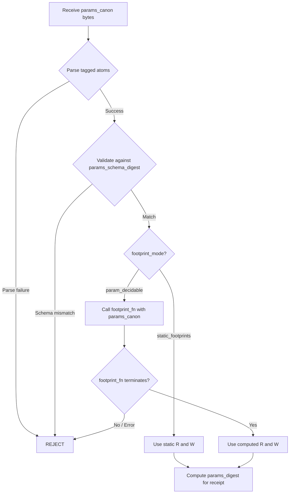

# CK-0 Kernel Param Canonicalization

**Version:** 1.0  
**Status:** Canonical  
**Phase:** Phase 0 (Pre-Build Tightening)  
**Related:** [`7_rounding_canonicalization.md`](7_rounding_canonicalization.md), [`C_canonical_ids.md`](C_canonical_ids.md), [`../nk3/3_kernel_registry.md`](../nk3/3_kernel_registry.md), [`../nk1/1_constants.md`](../nk1/1_constants.md)

---

## Overview

This document defines the canonical representation, validation, and consumption rules for **kernel parameters** in the KernelRegistry. Kernel params flow through three gates:

1. **ValueCanon encoding** — params are NK-1 tagged atoms, never opaque blobs.
2. **Schema validation** — params must match the kernel-specific `params_schema_digest`.
3. **Footprint consumption** — if footprint depends on params, `footprint_fn` receives canon param bytes, not Python dicts.

Violation of any gate is a **hard reject** — no fallback, no coercion.

---

## 1. ValueCanon Param Encoding

### 1.1 Tagged Atom Requirement

Every param value MUST be a **ValueCanon tagged atom** as defined by NK-1. The canonical form is:

```
<type_tag>:<payload>
```

| Type Tag | Payload Format | Example |
|----------|---------------|---------|
| `i` | Signed decimal integer, no leading zeros | `i:42` |
| `q` | `<scale>:<signed_int>` (fixed-point rational) | `q:6:-1500000` |
| `b` | `0` or `1` (boolean) | `b:1` |
| `s` | UTF-8 string, no NUL bytes | `s:relu` |
| `h` | 64 lowercase hex chars (Hash256) | `h:1a2b...f809` |
| `fid` | 32 lowercase hex chars (FieldID) | `fid:1a2b3c4d5e6f708192a3b4c5d6e7f809` |

### 1.2 Prohibited Representations

| Prohibited | Reason |
|------------|--------|
| Raw Python `dict` | Non-deterministic serialization order |
| Floating-point literals | Non-canonical; must convert via `q:6:` encoding |
| Bare integers without tag | Ambiguous type; `i:` prefix required |
| JSON-encoded strings | Frontend representation, not canon bytes |
| `None` / `null` | No nullable params; use sentinel tagged atom instead |

### 1.3 Param Tuple Encoding

A kernel's full param set is encoded as an **ordered tuple of tagged atoms**:

```
params_canon := CONCAT(len_prefix(atom_0), len_prefix(atom_1), ..., len_prefix(atom_n))
```

Where:
- Each `atom_k` is the UTF-8 byte encoding of the tagged atom string
- `len_prefix(x)` is `u32_be(len(x)) || x` (4-byte big-endian length prefix followed by atom bytes)
- Order is fixed by the kernel's param schema (field order is schema-defined, not alphabetical)

### 1.4 Param Digest

The canonical param digest is:

```
params_digest := SHA3_256(params_canon)
```

This digest is recorded in receipts and used for replay verification.

---

## 2. Params Schema Digest Validation

### 2.1 Schema Definition

Each kernel entry in the KernelRegistry MUST declare a `params_schema_digest`:

| Field | Type | Description |
|-------|------|-------------|
| `params_schema_digest` | Hash256 | SHA3-256 of the canonical param schema bytes |

A param schema defines:

| Schema Field | Type | Description |
|--------------|------|-------------|
| `field_name` | string | Param field name (lexicographic position in schema) |
| `field_tag` | TypeTag | Expected ValueCanon type tag |
| `required` | bool | Whether field must be present |
| `constraints` | Constraint[] | Optional value constraints (range, enum, etc.) |

### 2.2 Schema Encoding

The param schema itself is canonically encoded as:

```
schema_canon := CONCAT(
    for each field in schema_order:
        len_prefix(field_name_utf8),
        len_prefix(field_tag_utf8),
        u8(required),
        len_prefix(constraints_canon)
)
```

Where `schema_order` is the **declaration order** in the kernel spec (frozen at registration time).

### 2.3 Validation Rules

| Rule | Description |
|------|-------------|
| Tag match | Each param atom's type tag must match `field_tag` in schema |
| Arity match | Number of atoms must equal number of schema fields (unless optional fields omitted) |
| Order match | Atom order must match schema field declaration order |
| Constraint check | Each atom must satisfy its field's constraints |
| Digest match | `SHA3_256(schema_canon)` must equal `params_schema_digest` in KernelRegistry |

### 2.4 Rejection Criteria

Reject if ANY of the following:

- Param count does not match schema arity (accounting for optional fields)
- Any atom type tag does not match expected `field_tag`
- Any atom violates declared constraints
- `params_schema_digest` does not match the registry entry
- Any atom is not valid ValueCanon (fails tagged-atom parse)

---

## 3. Footprint Function Interface

### 3.1 Context

When [`footprint_mode = param_decidable`](../nk3/3_kernel_registry.md:36) in the KernelRegistry, the footprint is computed by an allowlisted function. This section defines the **canonical interface** that function must implement.

### 3.2 Function Signature

```
footprint_fn(params_canon: bytes) → FootprintResult
```

Where:

| Argument | Type | Description |
|----------|------|-------------|
| `params_canon` | `bytes` | Canonical param bytes as defined in §1.3 — NOT a Python dict |

| Return Field | Type | Description |
|-------------|------|-------------|
| `R` | `sorted_set[FieldID]` | Read set (sorted, deduped) |
| `W` | `sorted_set[FieldID]` | Write set (sorted, deduped) |
| `block_index` | `bool` | Whether kernel uses block indexing |
| `float_touch` | `bool` | Whether kernel touches floating-point values |
| `delta_bound_mode` | `DeltaBoundMode` | How delta bounds are computed |
| `requires_modeD` | `bool` | Whether mode-D is required |

### 3.3 Why Canon Bytes, Not Python Dict

| Concern | Canon Bytes | Python Dict |
|---------|------------|-------------|
| Determinism | Byte-exact input → deterministic output | Dict ordering varies across implementations |
| Replay | Same bytes on every replay | Serialization round-trip may alter key order |
| Cross-language | Language-agnostic byte protocol | Python-specific; breaks Rust/C verifiers |
| Hash chaining | `params_digest` chains directly into receipt | Must re-serialize to compute digest |

**Rule:** `footprint_fn` MUST parse `params_canon` internally using the kernel's param schema. It MUST NOT accept deserialized dicts, JSON, or any non-canonical representation.

### 3.4 Parsing Inside footprint_fn

The function must:

1. Accept raw `params_canon` bytes
2. Parse atoms using `len_prefix` framing (§1.3)
3. Validate each atom against the kernel's param schema
4. Extract typed values from tagged atoms
5. Compute footprint from extracted values

```
def footprint_fn(params_canon: bytes) -> FootprintResult:
    atoms = parse_len_prefixed_atoms(params_canon)
    validate_against_schema(atoms, KERNEL_PARAM_SCHEMA)
    # Extract typed values
    axis = parse_tagged_atom(atoms[0])   # e.g. i:2
    stride = parse_tagged_atom(atoms[1]) # e.g. i:4
    # Compute footprint from typed values
    R, W = compute_rw_sets(axis, stride)
    return FootprintResult(R=R, W=W, ...)
```

### 3.5 Footprint Function Constraints

| Constraint | Description |
|------------|-------------|
| Total | Defined for all valid `params_canon` (per schema) |
| Terminating | Must always terminate; no unbounded loops |
| Pure | No side effects, no I/O, no global state |
| Canonical output | R, W are sorted + deduped FieldID sets |
| Hash-locked | `footprint_fn_hash` must be in NK-3 allowlist |
| Byte-input only | Input is `params_canon: bytes`, never a deserialized object |

---

## 4. Integration Points

### 4.1 KernelRegistry Extension

The existing [`KernelSpec`](../nk3/3_kernel_registry.md:17) gains one new required field:

| Field | Type | Description |
|-------|------|-------------|
| `params_schema_digest` | Hash256 | SHA3-256 of canonical param schema bytes |

Kernels with no params use the **empty schema digest**:

```
EMPTY_PARAMS_SCHEMA_DIGEST := SHA3_256(b"")
```

### 4.2 Receipt Chain

Receipts must include:

| Field | Type | Description |
|-------|------|-------------|
| `params_digest` | Hash256 | SHA3-256 of `params_canon` bytes for this kernel invocation |

This enables the verifier to confirm that the exact same canonical params were used during replay.

### 4.3 Validation Order



---

## 5. Conformance Requirements

### 5.1 Golden Vectors

Implementations must pass the following golden vector tests:

| Test | Description |
|------|-------------|
| `param_canon_roundtrip` | Encode params → compute digest → decode → re-encode → digest must match |
| `param_schema_validation` | Valid params accepted; invalid params rejected at each rule in §2.3 |
| `footprint_fn_bytes_only` | Verify `footprint_fn` rejects non-canonical input (e.g. JSON string) |
| `empty_params_digest` | Kernel with no params produces `EMPTY_PARAMS_SCHEMA_DIGEST` |
| `param_order_sensitivity` | Swapping atom order must produce different `params_digest` |

### 5.2 Rejection Tests

| Test | Expected |
|------|----------|
| Wrong type tag on atom | REJECT |
| Missing required param | REJECT |
| Extra unexpected param | REJECT |
| Param atoms in wrong order | REJECT |
| Float literal instead of `q:6:` | REJECT |
| Bare integer without `i:` tag | REJECT |
| Dict passed to `footprint_fn` | REJECT (type error) |
