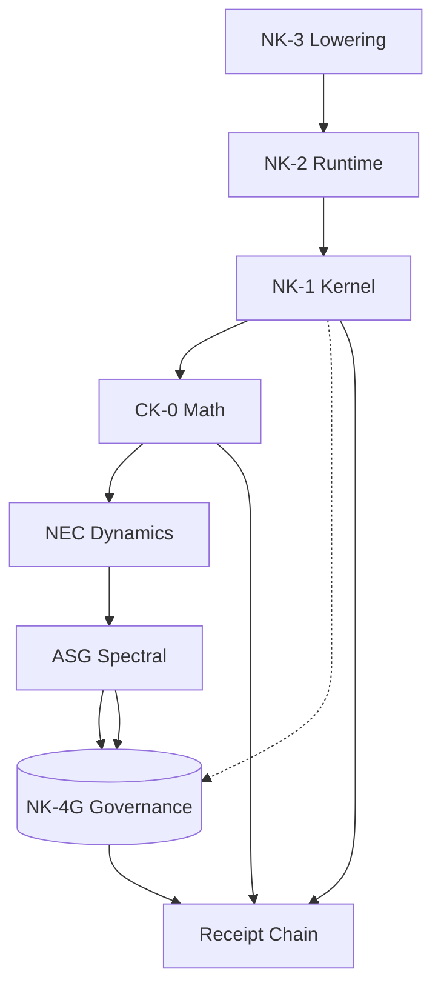

# NK-4G v1.0: Governance Certificate Verification Layer

**Version:** 1.0 (Revised)  
**Status:** Canonical  
**Depends on:** NK-1, NK-2, NK-3, ASG  
**Purpose:** Audit protocol for spectral certificates

---

## Purpose

NK-4G provides a geometric and spectral interpretation of the NK-1 coherence enforcement mechanism. It does **not** introduce new operators or modify runtime behavior.

### What NK-4G Provides

1. **Fixed weighted inner-product interpretation** of δ-norms
2. **Curvature interpretation** of ε residuals
3. **Lipschitz interpretation** of CTD distortion
4. **Spectral analysis** of discrete stability limits
5. **Zero-gap metastability model** for singular Hessian scenarios

### What NK-4G Does NOT Provide

- No new runtime degrees of freedom
- No new state variables
- No modification of NK-1/2/3 semantics
- No required operators for correctness

---

## Design Constraints

NK-4G must satisfy:

| Constraint | Requirement |
|------------|-------------|
| Semantic isolation | Must not change NK-1/2/3 behavior |
| Zero new state | No additional state variables |
| Policy-locked weights | Only PolicyBundle constants |
| Removability | Can be removed without breaking execution |
| Determinism | All interpretations are deterministic |

---

## Position in Architecture

NK-4G is an **audit layer** that:
- Consumes ASG spectral certificates
- Verifies receipt consistency
- Enforces policy thresholds

## ASG Integration

NK-4G consumes certificates from ASG (Adaptive Spectral Governance):

| ASG Output | NK-4G Verification |
|-----------|---------------------|
| κ₀ (kappa_0) | κ₀ ≥ NK4G_KAPPA_MIN |
| Γ_sem (gamma_sem) | Positive stiffness |
| M (margin) | M ≥ NK4G_MARGIN_MIN |
| operator_digest | Consistent with policy |
| projector_id | Matches required projector |

---

## Relationship to Other Components

| Component | Relationship |
|-----------|--------------|
| CK-0 | Interprets V(x), δ, ε as geometric quantities |
| NEC | Receives prox witness for drift/correction |
| ASG | Consumes spectral certificates (κ₀, Γ_sem, margin) |
| NK-1 | Uses PolicyBundle weights for metric; does not depend on NK-4G |
| NK-2 | CTD rule interpretation; does not depend on NK-4G |
| NK-3 | No direct relationship |

---

## Document Spine

| Document | Content |
|----------|---------|
| [`1_metric_structure.md`](1_metric_structure.md) | State space and fixed diagonal metric |
| [`2_curvature_definition.md`](2_curvature_definition.md) | Single-op, mixed residual, batch residual |
| [`3_ctd_distortion_bounds.md`](3_ctd_distortion_bounds.md) | CTD rule, Lipschitz bound, accumulated distortion |
| [`4_spectral_analysis.md`](4_spectral_analysis.md) | Quadratic model, split scheme, stability condition |
| [`5_zero_gap_regime.md`](5_zero_gap_regime.md) | Singular Hessian, center manifold, metastability |
| [`6_regularization_policy.md`](6_regularization_policy.md) | Artificial viscosity, compiler enforcement |
| [`7_verifier_consistency.md`](7_verifier_consistency.md) | No new verification rules |
| [`8_limits_and_nonclaims.md`](8_limits_and_nonclaims.md) | Explicit non-claims |
| [`9_formalization_plan.md`](9_formalization_plan.md) | Lean formalization milestones |

---

## Versioning

- **NK-4G v1.0**: Initial release
- Breaking changes to interpretation require version bump
- Removal of NK-4G does not affect protocol version
