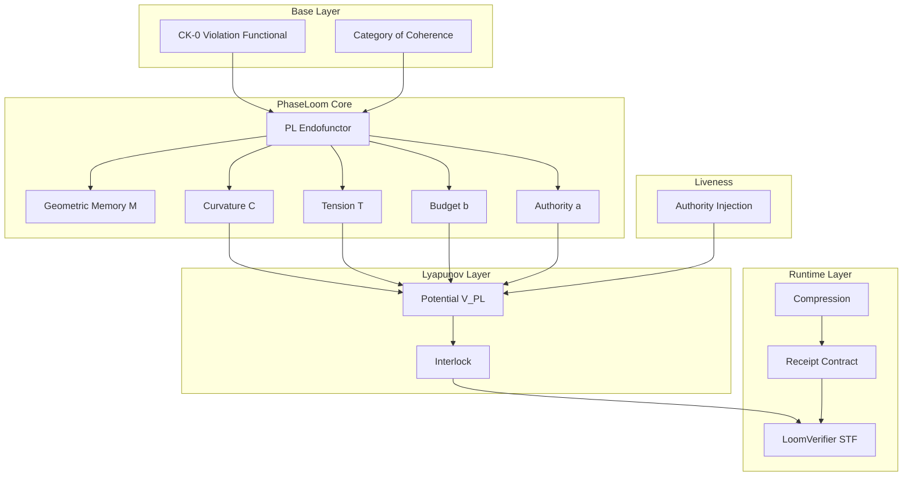

# PhaseLoom Potential — Geometric Memory

## Canon Doc Spine v1.0.0

**Scope:** CK-0 / (\mathbf{Coh}) + PhaseLoom Endofunctor + Fixed-Point Receipt Protocol + STF/LoomVerifier

**Layer:** L2 (Control & Time Geometry) projecting into L4 (Runtime) and L5 (Proof)

---

## 0. Changelog and Version Lock

### 0.1 Version

- `phaseloom_potential_geometric_memory_v1.0.0`

### 0.2 Compatibility Matrix

| Component | Version | Reference |
|-----------|---------|-----------|
| CK-0 | `ck0.v1` | Violation functional (V), faithfulness axiom |
| Coh | `coh.v1` | Objects ((X,V,\mathrm{RV})), morphisms, receipts |
| NK-1 | measured gate outputs | Authority (a), policy label (\sigma) |
| NK-2 | multi-clock scheduler | Interlock enforcement |
| Receipt schema | `coh.receipt.pl.v1` | PhaseLoom receipt v1 |
| STF module | `LoomVerifier` | Deterministic fixed-point engine |

### 0.3 Canon Locks (Non-Negotiable)

1. **Fixed-point arithmetic only** for consensus values
2. **Deterministic rounding:** truncate toward zero
3. **Canonical JSON serialization:** sorted keys, normalized numbers, UTF-8, no whitespace
4. **Exponential decay accumulator** for curvature and tension (\rho\in[0,1)) unless explicitly switching to ring-buffer windows

---

## 1. Executive Summary

PhaseLoom is a CK-0/(\mathbf{Coh}) construction that:

1. **Enlarges the state space** from (X) to (\tilde X = X \times M) to recover the **Markov property** for long-horizon coherence,
2. **Defines an extended Lyapunov functional** (\mathcal V_{PL}) ("PhaseLoom Potential") over (\tilde X),
3. **Enforces curvature-bounded viability** using a multi-clock interlock in NK-2,
4. **Makes all updates cryptographically verifiable** via `coh.receipt.pl.v1` and a deterministic STF (`LoomVerifier`),
5. **Resolves safety vs liveness** with an explicit **Authority Injection Morphism** requiring multi-sig authorization.

---

## 2. Module Architecture

---

## 3. Key Invariants

| Invariant | Description | Status |
|-----------|-------------|--------|
| Markov Recovery | Extended state \tilde X yields Markov process | PROVED |
| Curvature Bounded | C recurrence with exponential decay | ENFORCED |
| Budget Charge | \Delta b \ge \kappa_A A + \kappa_T \Delta T_{inc} | CONTRACT |
| Interlock Safety | No solve steps when b \le b_{min} | ENFORCED |
| Authority Liveness | Auth injection requires multisig | CONTRACT |

---

## 4. Quick Reference

### PhaseLoom Potential Definition

\mathcal{V}_{PL}(\tilde x) := w_0 V(x) + w_C \max(C,0) + w_T T + w_b \psi(b) + w_a a

### Curvature Recurrence

C^+ := \rho_C \cdot C + (A - D)

### Tension Recurrence

T^+ := \rho_T \cdot T + \Delta T_{\mathrm{inc}} - \Delta T_{\mathrm{res}}

### Interlock Condition

If b \le b_{min}, reject SOLVE steps with A > 0

---

## 5. Dependencies

- **src/ck0/** - Violation functional V(x), state space
- **src/coh/** - Category of Coherence, functors
- **src/nk1/** - ReceiptCanon, policy bundles
- **src/nk2/** - Scheduler, batch execution

---

## 6. Status

- **Phase:** Draft / Implementation Planning
- **Maturity:** v1.0.0 - Canon Spine Complete
- **Next:** Implementation of core modules in src/phaseloom/
