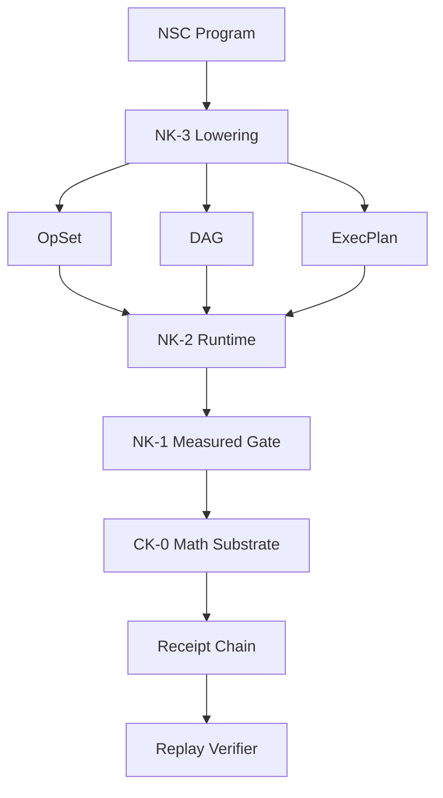
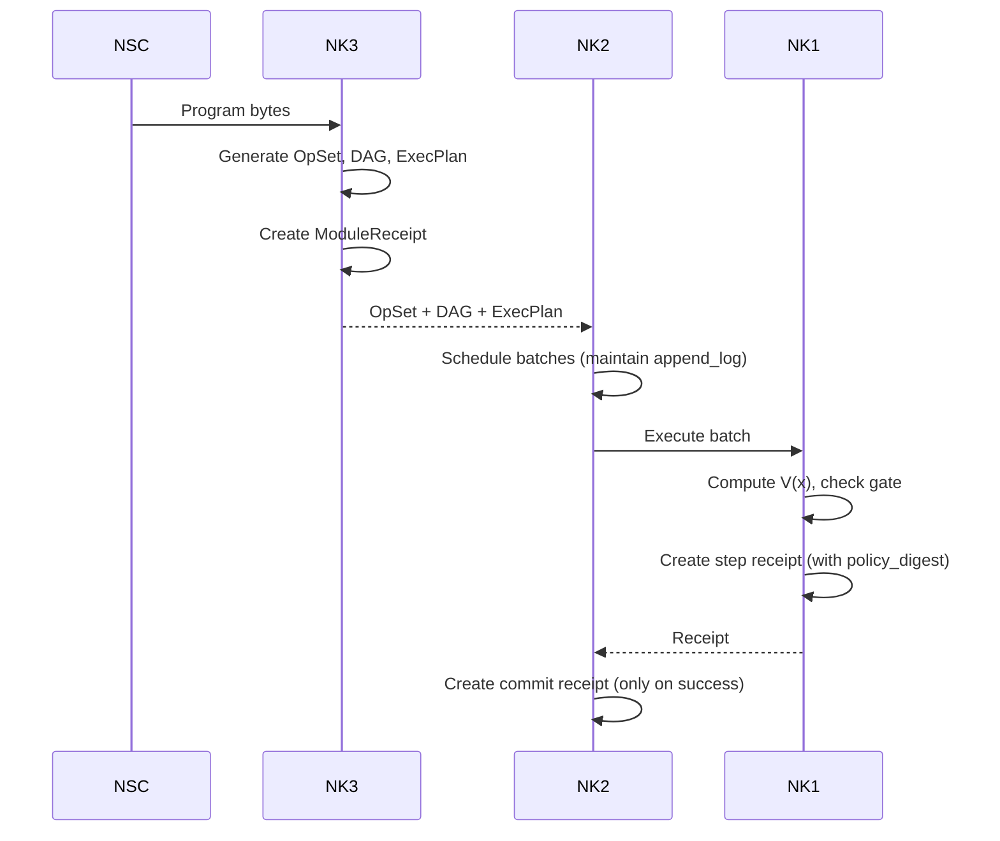

# Noetica v1.0 Complete Build Plan

**Date:** 2026-02-16  
**Status:** Draft - REVISED based on structural review  
**Scope:** Complete documentation + software implementation for Noetica v1.0

---

## PRE-BUILD TIGHTENING CHECKLIST

**CRITICAL**: These items must be resolved BEFORE any code is written. They prevent implementation drift, replay breaks, and reviewer attacks.

### 1.1 Canonical ID and Encoding Locks

| ID Type | Encoding | Length | Notes |
|---------|----------|--------|-------|
| FieldID | base16 lowercase | 32 hex chars (16 bytes) | Fixed length, no variants |
| Hash | base16 lowercase | 64 hex chars (32 bytes) | SHA-256 equivalent |
| OpID | Derived | Variable | Recipe: module_digest + node_path + binder_index → stable across toolchains |
| SchemaID | ASCII only | Variable | No Unicode, NFC irrelevant |
| PolicyID | ASCII only | Variable | No Unicode |
| KernelID | ASCII only | Variable | No Unicode |

**Implementation requirement**: All ID comparisons must be byte-exact. No normalization allowed.

### 1.2 Bytewise Sorting Rules

Lock: **sort by raw UTF-8 bytes** of canonical string encoding, OR sort by decoded bytes for hashes/FieldIDs.

Applies to:
- Op ordering in OpSet
- Field ordering in state
- Receipt key ordering
- DAG edge ordering
- KernelRegistry ordering

**Ban**: Locale-aware collation, locale-independent but non-bytewise sorting.

### 1.3 Operational ℛ Definition

Define "reachable region ℛ" operationally:

**Option A (Implicit)**: States encountered during execution that pass validation + invariants

**Option B (Explicit)**: Schema constraints + bounds per numeric field (min/max in quantized units)

**Decision required**: Either way, A_max, L_max, Hessian bounds must be enforceable contracts with documented constants.

### 1.4 KernelRegistry Param Canonicalization

- **Params must be ValueCanon** (NK-1 tagged atoms), not "JSON anything"
- **Params must be validated** against kernel-specific `params_schema_digest`
- If footprint depends on params, footprint_fn must take **canon param bytes**, not Python dict

### 1.5 Capability Ban List (Ambient Nondeterminism)

**Banned capabilities** in kernel/V_DU/footprint_fn/NK-3 lowering:
- system clock
- random / RNG
- thread count
- environment variables
- filesystem enumeration
- hash map iteration order
- network access
- process ID

**Enforcement**: Compile-time capability typing OR runtime traps in all canonical paths.

### 1.6 Failure Return Object Semantics

Define exactly what runtime returns on halt:

| Scenario | Return Value |
|----------|--------------|
| Resource cap halt | Terminal error code + op_id + pre_state_hash |
| Singleton failure halt | Terminal error code + op_id + pre_state_hash |
| Policy veto | Terminal error code + op_id + pre_state_hash |

**Rules**:
- Error object includes failing op_id
- Error object is NOT ledger-mutating
- Error object is NOT receipted (no receipt emitted)
- Error object hash included in parent commit receipt for traceability

### 1.7 Conformance Pack Manifest

Define a manifest file listing ALL golden vector artifacts:

```
conformance_manifest.json:
{
  "version": "v1.0",
  "artifacts": [
    {"name": "state_canon_bytes", "file": "state_canon.json", "hash": "<hex>"},
    {"name": "receipt_canon_bytes", "file": "receipt_canon.json", "hash": "<hex>"},
    {"name": "merkle_root", "file": "merkle_golden.json", "hash": "<hex>"},
    {"name": "matrix_canon_bytes", "file": "matrix_canon.json", "hash": "<hex>"},
    {"name": "policy_bundle_bytes", "file": "policy_golden.json", "hash": "<hex>"},
    {"name": "epsilon_hat_examples", "file": "eps_hat_golden.json", "count": N},
    {"name": "epsilon_measured_examples", "file": "eps_measured_golden.json", "count": N},
    {"name": "dag_ordering_examples", "file": "dag_order_golden.json", "count": N}
  ]
}
```

**Command**: `noetica conformance-check --manifest conformance_manifest.json`

### 1.8 Allocation Failure = Deterministic Cap

In canonicalization paths:
- If `canon_state_bytes()` allocates and allocation fails → **deterministic halt**
- NOT "best effort" or "graceful degradation"
- Treated as RESOURCE_CAP_MODE violation

### 1.9 Join Op Semantics (Locked)

For `op.join.v1`:
- **Emits local receipt**: YES
- **Participates in scheduling DAG**: YES
- **Has state effect**: NO (W=∅)
- **Can be removed by NK-3 v1.0**: NO (No Optimization Clause)
- **Has deterministic input semantics**: YES (waits for all predecessors)

### 1.10 Tokenless = Frontend Gate

- NK-3 v1.0 canonical input is **NSC.v1 bytes**
- Tokenless is a **frontend choice**, not execution choice
- **Frontend acceptability criterion**: Produces exact same canonical NSC.v1 bytes for same program meaning, binds NSC digest into ModuleReceipt

**Tokenless becomes Phase-1.5 frontend milestone, not Phase-1 runtime milestone**

---

## Executive Summary

This plan addresses the complete buildout of Noetica v1.0, a coherence enforcement framework with four specification layers:

- **CK-0**: Mathematical substrate (invariants, violation functional, budget/debt law)
- **NK-1**: Certificate-side runtime kernel (DebtUnit arithmetic, measured gate, receipts)
- **NK-2**: Runtime execution + scheduler (deterministic batching, failure handling)
- **NK-3**: Lowering layer (NSC → OpSet/DAG/ExecPlan)

The plan addresses two parallel tracks:
1. **Documentation Completions**: Fix gaps identified in existing plans
2. **Software Implementation**: Build the actual implementation

---

## Architecture Overview



### Dependency Chain

| Layer | Depends On | Produces |
|-------|------------|----------|
| CK-0 | (none - base) | Mathematical contracts |
| NK-1 | CK-0 | Runtime kernel, receipts |
| NK-2 | NK-1 | Scheduled execution |
| NK-3 | NK-1, NK-2 | Lowered artifacts |

---

## Part 1: Documentation Completions

### 1.1 CK-0 Documentation Gaps (from ck0_gap_analysis.md)

| Priority | Gap | Action | Files to Modify |
|----------|-----|--------|-----------------|
| HIGH | Service Policy IDs missing | Add `service_policy_id` and `service_instance_id` to receipt schema | `docs/ck0/8_receipts_omega_ledger.md` |
| HIGH | Disturbance Accounting Rule | Add explicit rule to prevent silent disturbance loophole | `docs/ck0/4_budget_debt_law.md` |
| MEDIUM | Service Law Admissibility (A1-A6) | Formalize conditions A1-A6 in service law section | `docs/ck0/4_budget_debt_law.md` |
| MEDIUM | Per-Contract Receipt Fields | Verify `m_k` dimension is documented | `docs/ck0/8_receipts_omega_ledger.md` |
| LOW | V(x) One-Line Canon | Add exact canon summary to overview | `docs/ck0/0_overview.md` |

### 1.2 CK-0 Hardening (from ck0_hardening_plan.md)

Add the following spec language to CK-0 documentation:

| Section | Content | Files to Modify |
|---------|---------|-----------------|
| A.1 | Disturbance Separation Rule | `docs/ck0/4_budget_debt_law.md` |
| A.2 | Disturbance Policy Classes (DP0-DP3) | `docs/ck0/4_budget_debt_law.md` |
| A.3 | Receipt obligations for disturbance | `docs/ck0/8_receipts_omega_ledger.md` |
| B | CK-0 as Constrained Semigroup | `docs/ck0/1_state_space.md` |

### 1.3 NK-1, NK-2, NK-3 Documentation Status

Based on overview documents, all four phases show "Done" status. Review conformance docs to verify completeness:

| Phase | Status per Docs | Review Needed |
|-------|-----------------|---------------|
| NK-1 | ✅ Complete (v1.0) | `docs/nk1/9_conformance.md` |
| NK-2 | ✅ Complete (v1.0) | `docs/nk2/9_conformance.md` |
| NK-3 | ✅ Complete (v1.0) | `docs/nk3/9_conformance.md` |

---

## Part 2: Software Implementation

### Phase 0: Pre-Build Tightening (MUST COMPLETE BEFORE PHASE 1)

| Step | Task | Pre-Build Requirement |
|------|------|----------------------|
| 0.1 | Freeze all ID encodings | Document in spec: FieldID, Hash, OpID, SchemaID, PolicyID, KernelID formats |
| 0.2 | Define bytewise sorting | Document sorting rules for all ordered collections |
| 0.3 | Define operational ℛ | Document reachable region as implicit OR explicit bounds |
| 0.4 | KernelRegistry param profile | Document ValueCanon requirements + params_schema_digest |
| 0.5 | Implement capability ban list | Add runtime traps for banned capabilities |
| 0.6 | Define failure semantics | Document error return objects for halt scenarios |
| 0.7 | Create conformance manifest | Define format + generate golden vectors |
| 0.8 | Allocation failure handling | Document as deterministic cap halt |
| 0.9 | Lock join op semantics | Document in spec: receipt, DAG participation, no-opt clause |
| 0.10 | Tokenless frontend gate | Document as NSC digest equality criterion |

**Gate**: Phase 0 must be 100% complete before any implementation code is written.

### 2.1 Implementation Architecture

```
src/
├── ck0/                    # Mathematical substrate
│   ├── debtunit.py         # Exact integer arithmetic
│   ├── state_space.py      # Typed state space
│   ├── invariants.py       # Hard invariant checking
│   ├── violation.py        # V(x) functional computation (with DebtUnit enforcement)
│   ├── budget_law.py       # Service law S(D,B)
│   ├── curvature.py        # NEC closure / M matrix with canonicalization
│   ├── transition.py       # Transition contract T(x,u)
│   ├── rounding.py         # Half-even rounding, canonicalization
│   ├── receipts.py         # Receipt schema
│   └── verifier.py         # Replay verifier
│
├── nk1/                    # Runtime kernel
│   ├── debtunit.py         # Exact integer arithmetic (re-export)
│   ├── policy_bundle.py    # PolicyBundle canonicalization + digest
│   ├── contracts.py        # V(x) measurement engine
│   ├── measured_gate.py   # Gate decision logic
│   ├── curvature.py       # Curvature registry + M-entry parser
│   ├── actions.py          # Action parsing
│   ├── receipts.py         # Receipt generation with policy binding
│   ├── verifier.py         # Replay verifier
│   └── resource_guard.py  # deterministic_reject.v1 for BIGINT caps
│
├── nk2/                    # Execution runtime
│   ├── exec_plan.py        # ExecPlan + OpSpec
│   ├── runtime_state.py    # State management
│   ├── scheduler.py        # Greedy.curv.v1 with append_log
│   ├── batch_attempt.py    # Batch execution (no receipts on failure)
│   ├── commit_receipts.py  # Commit receipts
│   ├── failure_handling.py # Rescheduling with singleton terminal rule
│   ├── resource_caps.py    # Resource cap enforcement
│   └── main_loop.py        # Termination algorithm
│
└── nk3/                    # Lowering layer
    ├── canon_inputs.py     # NSC.v1 canonicalization + hash
    ├── opset.py            # OpSet generation
    ├── dag.py              # DAG construction with join nodes
    ├── execplan.py         # ExecPlan generation
    ├── module_receipt.py   # Module receipt
    └── hazard_control.py   # WAW/WAR edge construction
```

### 2.2 Critical Enforcement Clauses (Referee-Hostile)

The following must be explicitly implemented to preserve canon integrity:

#### CK-0 Enforcement

| Rule | Implementation Requirement |
|------|---------------------------|
| **V(x) DebtUnit enforcement** | V(x) must compute in rational space and convert exactly once to DebtUnit integer via half-even rounding under DEBT_SCALE from PolicyBundle. No floats, no rational outputs, no mixed units. |
| **Curvature canonicalization** | M matrix entries must be reduced rationals (gcd=1), stored symmetrically (i≤j), default 0, with canonical byte encoding (canon_matrix_bytes.v1). Matrix digest bound into PolicyBundle. |
| **No silent disturbances** | E_k must be explicitly logged (even if 0) per disturbance policy. Verifier rejects silent disturbances. |

#### NK-1 Enforcement

| Rule | Implementation Requirement |
|------|---------------------------|
| **PolicyBundle chain lock** | policy_digest must be constant across entire chain. Implement PolicyBundle canonicalization + digest comparison per commit. |
| **Resource guard in kernel** | deterministic_reject.v1 resource guard integrated into DebtUnit, V_DU, ε̂ computation. Rejection callable from NK-1 kernel, not only scheduler. |

#### NK-2 Enforcement

| Rule | Implementation Requirement |
|------|---------------------------|
| **append_log preservation** | Scheduler must maintain canonical append_log during batch construction. last-added op defined from append_log for replay stability. |
| **Singleton terminal halt** | Implement per §2.6.B: singleton kernel_error → terminal halt, singleton delta_bound → terminal halt. No retry loops. |
| **No-attempt-receipts** | Failed batch attempts must NOT emit receipts. Only successful commits emit receipts. |

#### NK-3 Enforcement

| Rule | Implementation Requirement |
|------|---------------------------|
| **NSC canonicalization** | Define canonical NSC.v1 byte profile + hash rule (H_R). Lowering is pure function of NSC bytes + PolicyBundle + KernelRegistry. |
| **No optimization clause** | NK-3 v1.0 performs NO semantic transforms beyond normalization. No constant folding, no instruction reordering, no DCE, no peephole transforms unless separately versioned. |
| **Explicit join nodes** | DAG builder inserts op.join.v1 for IF merges per control_edge_mode. |

### 2.3 Implementation Phases

#### Phase 1: CK-0 Mathematical Substrate

| Step | Task | Critical Enforcement |
|------|------|---------------------|
| 1.1 | Implement DebtUnit exact integer arithmetic | No floats, exact integer quanta |
| 1.2 | Implement state space and typing | Typed state space with field blocks |
| 1.3 | Implement hard invariants I(x) | Hard constraint categories |
| 1.4 | Implement violation functional V(x) | **MUST**: rational → DebtUnit via half-even rounding under DEBT_SCALE. Reject NaN/Inf |
| 1.5 | Implement service law S(D,B) | Deterministic, monotonic, A1-A6 conditions |
| 1.6 | Implement curvature matrix M | **MUST**: reduced rationals (gcd=1), symmetric storage, canon_matrix_bytes.v1, digest bound |
| 1.7 | Implement transition contract T(x,u) | Deterministic evolution |
| 1.8 | Implement rounding/canonicalization | Half-even rounding, anti-wedgeability |
| 1.9 | Implement receipt schema | **MUST**: service_policy_id, service_instance_id, disturbance_policy_id, E_k logged |
| 1.10 | Implement replay verifier | Verifies receipts, policy compliance, law satisfaction |

#### Phase 2: NK-1 Runtime Kernel

| Step | Task | Critical Enforcement |
|------|------|---------------------|
| 2.1 | Implement DebtUnit library | Re-export CK-0 |
| 2.2 | Implement PolicyBundle canonicalization | **MUST**: policy_digest constant across chain, digest comparison per commit |
| 2.3 | Implement contract measurement engine | V(x) in DebtUnit |
| 2.4 | Implement measured gate logic | epsilon_measured ≤ epsilon_hat |
| 2.5 | Implement curvature registry | M-entry parser, rational_scaled.v1 |
| 2.6 | Implement resource guard (deterministic_reject.v1) | **MUST**: integrated into DebtUnit, V_DU, ε̂ computation |
| 2.7 | Implement action parsing | Un-wedgeable parsing |
| 2.8 | Implement receipt pipeline | Hash-chained, canonical JSON, policy binding |
| 2.9 | Implement replay verifier | Standalone, byte-for-byte verification |
| 2.10 | Build conformance test suite | Golden vectors, determinism tests |

#### Phase 3: NK-2 Runtime Execution

| Step | Task | Critical Enforcement |
|------|------|---------------------|
| 3.1 | Implement ExecPlan + OpSpec | Deterministic job spec |
| 3.2 | Implement runtime state | Immutable state, ledger anchor |
| 3.3 | Implement Greedy.curv.v1 scheduler | **MUST**: maintain append_log during batch construction |
| 3.4 | Implement batch attempt | **MUST**: no receipts on failure |
| 3.5 | Implement commit receipts | Only on success |
| 3.6 | Implement failure handling | **MUST**: singleton terminal halt per §2.6.B |
| 3.7 | Implement resource caps | Deterministic reject |
| 3.8 | Implement main loop | Canonical termination |
| 3.9 | Build conformance tests | Determinism, rescheduling, no-attempt tests |

#### Phase 4: NK-3 Lowering Layer

| Step | Task | Critical Enforcement |
|------|------|---------------------|
| 4.1 | Implement NSC canonicalization | **MUST**: NSC.v1 byte profile, H_R hash rule, pure function semantics |
| 4.2 | Implement OpSet generation | Deterministic, sorted by op_id |
| 4.3 | Implement DAG construction | **MUST**: insert op.join.v1 for IF merges |
| 4.4 | Implement ExecPlan generation | Policy-bound scheduler config |
| 4.5 | Implement module receipt | Binds all digests |
| 4.6 | Implement hazard control | WAW/WAR edges only |
| 4.7 | Build conformance tests | **MUST**: no optimization beyond normalization |

#### Phase 4b: NK-3 Detailed Specification (Pre-Implementation)

**CRITICAL**: Before implementing NK-3, the following decisions must be made and documented:

| Decision | Options | Required Action |
|----------|---------|----------------|
| **IF in v1.0?** | Deferred / Included | If deferred: straight-line only. If included: implement join insertion |

**NK-3 §0 Meaning Preservation Contract** - Implement these sub-steps:

| Sub-step | Requirement |
|----------|-------------|
| 0.1 | Define InputBundle: P_nsc_bytes, policy_bundle_id, policy_digest, kernel_registry_digest, toolchain_ids, schemas_digest_set |
| 0.2 | Document Lowering Purity Axiom: pure function of InputBundle only |
| 0.3 | Define Meaning(P, x0) = (H_X(x_final), LedgerValid binding module_receipt_digest) |
| 0.4 | Document Meaning Preservation Theorem conditions |
| 0.5 | Lock No Optimization Clause: only specified normalization + join insertion |
| 0.6 | Define hazard edge set: id:hazard.WAR.v1, id:hazard.WAW.v1, id:control.explicit.v1 only |
| 0.7 | Define kernel footprint interface: static OR param-decidable via footprint_fn |

**NK-3 §1 Canonical NSC Bytes Profile** - Implement these sub-steps:

| Sub-step | Requirement |
|----------|-------------|
| 1.1 | Implement CANON_PROFILE_ID = id:nk1.valuecanon.v1 |
| 1.2 | Define NSCProgram object: nsc_id, canon_profile_id, schema_id, kernel_registry_digest, policy_digest, decls[], entry |
| 1.3 | Define Decl structure: decl_id, params[], body - closed set |
| 1.4 | Define Stmt forms: SEQ, CALL, WRITE, ASSERT, IF (optional), JOIN |
| 1.5 | Document CALL normalization: args sorted, binds sorted, no implicit temps |
| 1.6 | Literal normalization: integers i:<decimal>, fixed q:<scale>:<int> |
| 1.7 | Field refs: f:<hex_fixedlen> only |
| 1.8 | Control-flow: IF requires op.join.v1 insertion |
| 1.9 | Program digest: H_R(P_nsc_bytes) bound in ModuleReceipt |
| 1.10 | Tokenless = frontend equivalence via NSC bytes

### 2.4 Test Strategy

Each phase must include:

1. **Unit tests** for all core functions
2. **Golden vector tests** from conformance documents
3. **Determinism tests** - same input → same output
4. **Replay tests** - verify receipts can be verified
5. **Enforcement tests** - verify all Critical Enforcement Clauses are tested

---

## Part 3: Integration Points

### 3.1 Cross-Layer Contracts

| From | To | Contract |
|------|-----|----------|
| NK-3 → NK-2 | OpSet, DAG, ExecPlan must match NK-2 schema |
| NK-2 → NK-1 | epsilon_measured ≤ epsilon_hat for all batches |
| NK-1 → CK-0 | All receipts satisfy CK-0 law |
| Policy | All layers | policy_digest constant across entire chain |

### 3.2 Receipt Chain



---

## Part 4: Deliverables Checklist

### 4.1 Documentation

- [ ] CK-0: Add service_policy_id to receipts
- [ ] CK-0: Add disturbance accounting rule
- [ ] CK-0: Formalize service law admissibility (A1-A6)
- [ ] CK-0: Add semigroup formulation
- [ ] Review NK-1/NK-2/NK-3 conformance docs

### 4.2 Software - CK-0

- [ ] 1.1 DebtUnit arithmetic (exact integers)
- [ ] 1.2 State space and typing
- [ ] 1.3 Hard invariants I(x)
- [ ] 1.4 V(x) with half-even rounding enforcement
- [ ] 1.5 Service law S(D,B)
- [ ] 1.6 Curvature matrix with canonicalization
- [ ] 1.7 Transition contract
- [ ] 1.8 Rounding/canonicalization
- [ ] 1.9 Receipt schema with all required fields
- [ ] 1.10 Replay verifier

### 4.3 Software - NK-1

- [ ] 2.1 DebtUnit library
- [ ] 2.2 PolicyBundle canonicalization + chain lock
- [ ] 2.3 Contract measurement engine
- [ ] 2.4 Measured gate logic
- [ ] 2.5 Curvature registry
- [ ] 2.6 Resource guard (deterministic_reject.v1)
- [ ] 2.7 Action parsing
- [ ] 2.8 Receipt pipeline
- [ ] 2.9 Replay verifier
- [ ] 2.10 Conformance tests

### 4.4 Software - NK-2

- [ ] 3.1 ExecPlan + OpSpec
- [ ] 3.2 Runtime state
- [ ] 3.3 Scheduler with append_log
- [ ] 3.4 Batch attempt (no-failure-receipts rule)
- [ ] 3.5 Commit receipts
- [ ] 3.6 Failure handling with singleton terminal
- [ ] 3.7 Resource caps
- [ ] 3.8 Main loop
- [ ] 3.9 Conformance tests

### 4.5 Software - NK-3

- [ ] 4.1 NSC canonicalization (NSC.v1 + hash)
- [ ] 4.2 OpSet generation
- [ ] 4.3 DAG with join nodes
- [ ] 4.4 ExecPlan generation
- [ ] 4.5 Module receipt
- [ ] 4.6 Hazard control
- [ ] 4.7 Conformance tests (no-optimization enforced)

### 4.6 Integration

- [ ] Cross-layer contract verification
- [ ] Full conformance test suite passing
- [ ] Documentation complete

---

## Part 5: Milestones

### Milestone 0: Pre-Build Tightening (GATE)
- [ ] All 10 pre-build items documented in spec
- [ ] Capability ban list implemented as runtime traps
- [ ] Conformance manifest created with golden vectors
- [ ] **GATE**: No implementation code until this is 100% complete

### Milestone 1: CK-0 Core
- Documentation gaps fixed
- Mathematical substrate implemented
- Replay verifier working
- **V(x) half-enforcement enforced**
- **Curvature canonicalization enforced**

### Milestone 2: NK-1 Kernel
- Runtime kernel complete
- DebtUnit arithmetic verified
- **PolicyBundle chain lock enforced**
- **Resource guard in kernel enforced**
- Receipt chain functional

### Milestone 3: NK-2 Execution
- Scheduler working
- **append_log preserved**
- **Singleton terminal rule enforced**
- **No-attempt-receipts rule enforced**
- Batch attempt functional

### Milestone 4: NK-3 Lowering
- **NSC canonicalization enforced**
- **No optimization clause enforced**
- **Join nodes inserted**
- NSC → runtime artifacts
- Module receipts working

### Milestone 5: Integration
- Cross-layer contracts verified
- Full conformance test suite passing
- Documentation complete
